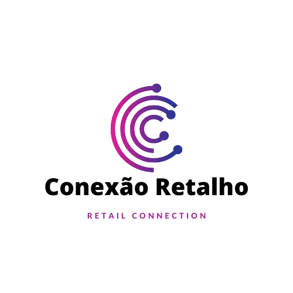
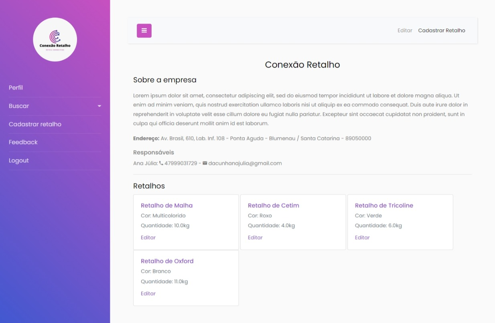

<!-- Improved compatibility of back to top link: See: https://github.com/othneildrew/Best-README-Template/pull/73 -->
<a name="readme-top"></a>
<!--
*** Thanks for checking out the Best-README-Template. If you have a suggestion
*** that would make this better, please fork the repo and create a pull request
*** or simply open an issue with the tag "enhancement".
*** Don't forget to give the project a star!
*** Thanks again! Now go create something AMAZING! :D
-->


<!-- PROJECT SHIELDS -->
<!--
*** I'm using markdown "reference style" links for readability.
*** Reference links are enclosed in brackets [ ] instead of parentheses ( ).
*** See the bottom of this document for the declaration of the reference variables
*** for contributors-url, forks-url, etc. This is an optional, concise syntax you may use.
*** https://www.markdownguide.org/basic-syntax/#reference-style-links
-->
[![Contribuitors][contributors-shield]][contributors-url]


<!-- PROJECT LOGO -->
<br />
<div align="center">
  <a href="https://github.com/cunhanai/Conexao-Retalho">
    
  </a>

  <h3 align="center">Conexão Retalho</h3>

  <p align="center">
    Sistema de doação de retalhos
    <br />
    <a href="https://github.com/cunhanai/Conexão-Retalho"><strong>Explore nosso projeto »</strong></a>
    <br />
   
  </p>
</div>


<!-- TABLE OF CONTENTS -->
<details>
  <summary>Índice</summary>
  <ol>
    <li>
      <a href="#sobre-o-projeto">Sobre o projeto</a>
      <ul>
        <li><a href="#dados-motivadores">Dados motivadores</a></li>
        <li><a href="#benefícios">Benefícios</a></li>
        <li><a href="#construído-com">Construído com</a></li>
      </ul>
    </li>
    <li>
      <a href="#getting-started">Getting Started</a>
      <ul>
        <li><a href="#pré-requisitos">Pré-requisitos</a></li>
        <li><a href="#iniciando-a-aplicação">Iniciando a aplicação</a></li>
      </ul>
    </li>
    <li><a href="#contatos">Contatos</a></li>
  </ol>
</details>


<!-- ABOUT THE PROJECT -->
## Sobre o projeto

<div align="center" class="row">
  <a href="https://github.com/cunhanai/Conexao-Retalho">
    
  </a>
 </div>
<br>
Este é o projeto final de conclusão do Curso de Java no Entra21 (2022).

Nós buscamos criar um projeto de cunho social que auxilie a comunidade e o meio ambiente por meio da conecxão entre empresas têxteis e ONGs para intermediar doações de retalhos excedentes em sua produção. As ONGs se utilizam dessas peças para angariar de fundos ou criação de produtos artesanais para seus projetos.

<p align="right">(<a href="#readme-top">voltar pro topo</a>)</p>

### Dados motivadores

<div>
  <ul>
    <li>4M de toneladas de resíduos têxteis são gerado por ano no Brasil</li>
    <li>Cerca de 80% vão parar nos lixões</li>
    <li>67% das ONGs perderam mais da metade de sua arrecadação durante a pandemia</li>
  </ul>
</div>

<p align="right">(<a href="#readme-top">voltar pro topo</a>)</p>

### Benefícios

<div>

  Para a empresa:
  <ul>
    <li>Visibilidade</li>
    <li>Ajudar no Imposto de Renda</li>
    <li>Demonstrar que está engajado em projetos socioambientais</li>
  </ul>
  
  Para a ONG:
  <ul>
    <li>Angariar fundos</li>
    <li>Ajudar nos projetos da ONG</li>
    <li>Visibilidade</li>
  </ul>
  
  Para a natureza:
  <ul>
    <li>Reciclagem e redução de lixo</li>
    <li>Preservação de espécies</li>
    <li>Aumento da qualidade de vida</li>
  </ul>
 </div>
  

<p align="right">(<a href="#readme-top">voltar pro topo</a>)</p>


### Construído com
 
* Java
* Spring (Spring Framework, Spring Boot, Spring Data JPA, Spring Security, Spring Web para a criação da aplicação)
* MySQL
* Bootstrap
* Thymeleaf
* Git
* Github
* Maven

<p align="right">(<a href="#readme-top">voltar pro topo</a>)</p>


<!-- GETTING STARTED -->
## Getting Started

### Pré-requisitos

1. Uma IDE (preferencialmente Eclipse)
2. MySQKL Workbench

### Iniciando a aplicação

1. Clonar o repositório
   ```sh
   git clone https://github.com/cunhanai/Conexao-Retalho.git
   ```
3. Importar para dentro da IDE como Maven Project
   
4. Criar um banco de dados
   ```sh
   create schema conexaoretalho;
   ```
 5. Executar o arquivo `onexaoretalhoApplication.java`

<p align="right">(<a href="#readme-top">voltar pro topo</a>)</p>

<!-- CONTATOS -->
## Contatos

* [Ana Júlia](https://www.linkedin.com/in/ana-julia-cunha/)
* [Wesley Jaguaracy](https://www.linkedin.com/in/wesley-jaguaracy-928575189/)
* [Lucas Martins](https://www.linkedin.com/in/lucas-martins-020867241/)
* [Claudia Emily](https://www.linkedin.com/in/claudia-schluetter-804053208/)
* [Ana Pradela](https://www.linkedin.com/in/ana-pradela-39b86a232/)

Link do Projeto: [https://github.com/cunhanai/Conexao-Retalho](https://github.com/cunhanai/Conexao-Retalho)

<p align="right">(<a href="#readme-top">voltar pro topo</a>)</p>


<!-- MARKDOWN LINKS & IMAGES -->
<!-- https://www.markdownguide.org/basic-syntax/#reference-style-links -->
[contributors-shield]: https://img.shields.io/github/contributors-anon/cunhanai/Conexao-Retalho?style=for-the-badge
[contributors-url]: https://github.com/cunhanai/Conexao-Retalho
[product-screenshot]: images/screenshot.png
